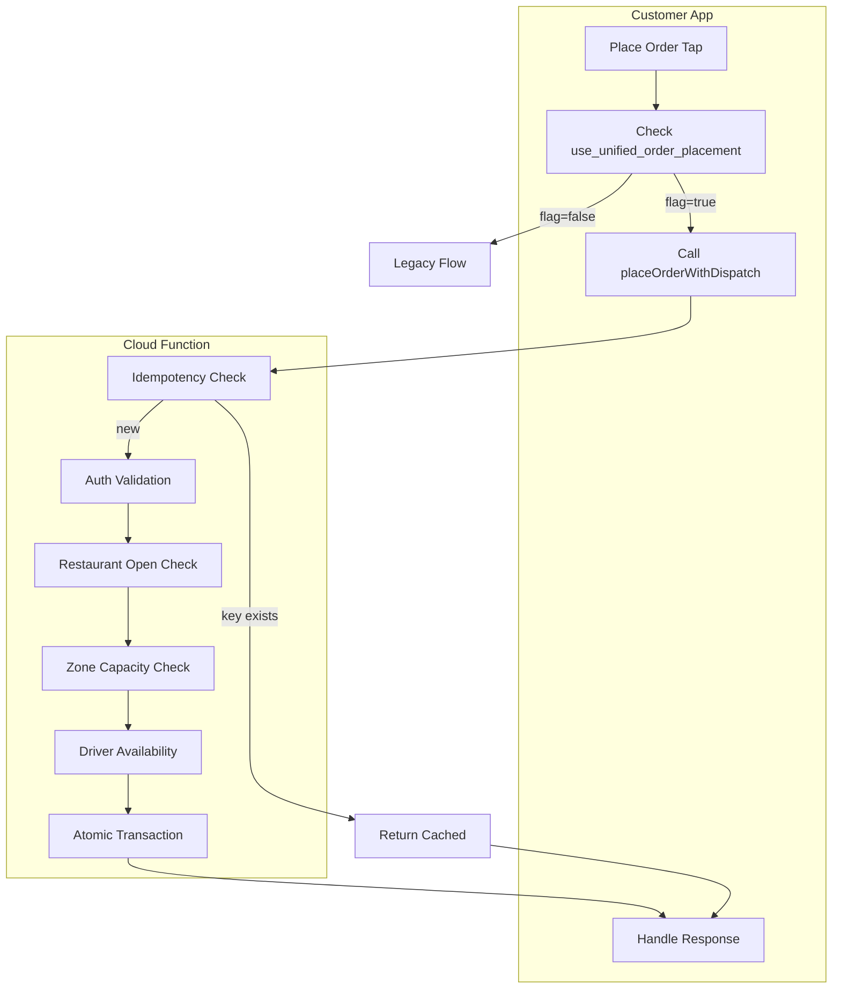

# Unified Order Placement System

## Overview

The unified order placement system replaces the dual availability check (DispatchPrecheckService + autoDispatcher) with a single callable Cloud Function `placeOrderWithDispatch` that atomically validates, checks driver availability, and creates orders. Customers receive immediate, accurate feedback about driver availability.

## Architecture



## Cloud Function: placeOrderWithDispatch

### Input

```json
{
  "order": { /* OrderModel.toJson() output */ },
  "idempotencyKey": "uuid-v4-string"
}
```

### Success Response

```json
{
  "success": true,
  "orderId": "abc123",
  "driverAssigned": true
}
```

### Error Response

```json
{
  "success": false,
  "code": "NO_DRIVERS_AVAILABLE",
  "message": "No delivery partners are available right now."
}
```

### Error Codes

| Code | Meaning |
|------|---------|
| `NO_DRIVERS_AVAILABLE` | No eligible drivers found; cart preserved |
| `RESTAURANT_CLOSED` | Vendor not open or not accepting orders |
| `ZONE_AT_CAPACITY` | Delivery zone at max concurrent orders |
| `VALIDATION_ERROR` | Invalid payload, restaurant not found |
| `UNAUTHENTICATED` | User not logged in |

## Feature Flag

- **Parameter**: `use_unified_order_placement` (boolean)
- **Default**: `false`
- **Control**: Firebase Remote Config
- **Behavior**: When `true`, checkout uses the callable; when `false`, uses legacy Firestore write + DispatchPrecheckService

## Idempotency

- **Collection**: `idempotency_keys`
- **Document ID**: Client-generated UUID
- **TTL**: 24 hours (`expireAt` field)
- **Logic**: If key exists, return stored result; no side effects

## Testing Plan

### Prerequisites

1. Deploy function: `firebase deploy --only functions:placeOrderWithDispatch`
2. Set Remote Config `use_unified_order_placement` to `true` for test users
3. Ensure test drivers with `riderAvailability: 'available'` and valid location

### Test Scenarios

| Scenario | Steps | Expected |
|----------|-------|----------|
| Happy path | Place order with drivers available | Order created, driver assigned, PlaceOrderScreen shown |
| No drivers | Place order with all drivers offline/busy | `NO_DRIVERS_AVAILABLE`, dialog, cart preserved |
| Restaurant closed | Place order when vendor `reststatus=false` or outside hours | `RESTAURANT_CLOSED` |
| Zone at capacity | Place order when zone maxRiders reached | `ZONE_AT_CAPACITY` |
| Duplicate (idempotency) | Call with same idempotency key twice | Second call returns cached result, no duplicate order |
| Race (2 orders, 1 driver) | Two customers place orders simultaneously | One succeeds, one gets `NO_DRIVERS_AVAILABLE` |
| Timeout | Simulate slow network | User sees timeout message, can retry |

### Emulator Testing

```bash
cd Admin
firebase emulators:start --only functions
# In Customer app, configure to use emulator:
# FirebaseFunctions.instanceFor(region: 'us-central1').useFunctionsEmulator('localhost', 5001);
```

## Runbook

### Monitor Function

```bash
firebase functions:log --only placeOrderWithDispatch --limit 50
```

### Log Patterns

- `[placeOrderWithDispatch] Success orderId=` – Order placed
- `[placeOrderWithDispatch] Restaurant closed` – Vendor validation failed
- `[placeOrderWithDispatch] Zone at capacity` – Zone limit hit
- `[placeOrderWithDispatch] No available riders` – No drivers (logged in driver selection)

### Rollback

1. Set Remote Config `use_unified_order_placement` to `false`
2. No code deploy required; users revert to legacy flow

### Gradual Rollout

1. Start at 1% (Remote Config percentage targeting)
2. Monitor success rate, `NO_DRIVERS_AVAILABLE` frequency, latency
3. Ramp to 10%, 25%, 50%, 100%
4. After stable: remove legacy path and DispatchPrecheckService

## Key Files

| File | Purpose |
|------|---------|
| `Admin/functions/index.js` | `placeOrderWithDispatch` callable |
| `Admin/firestore.rules` | `idempotency_keys` rule |
| `Customer/lib/ui/checkoutScreen/CheckoutScreen.dart` | Callable integration, feature flag |
